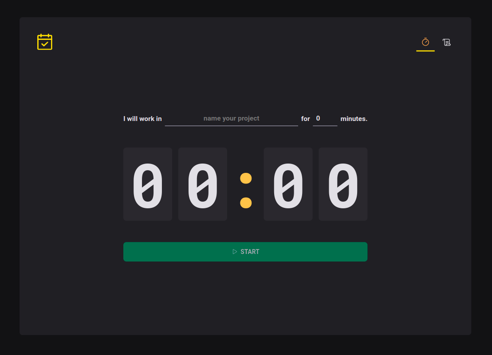
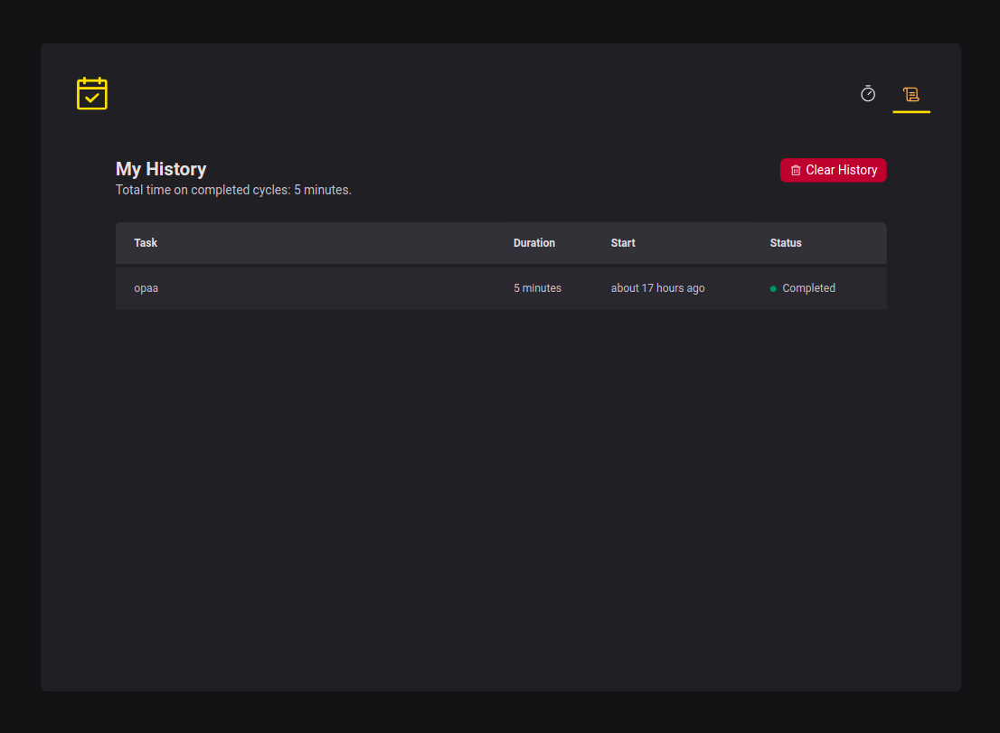
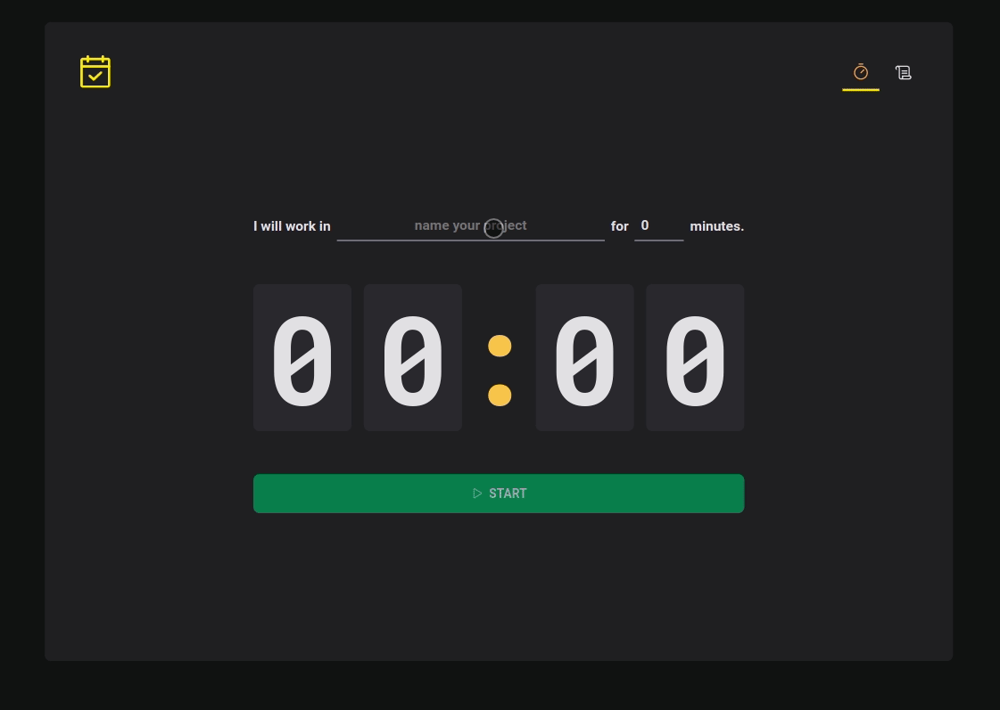

<br />

# :pushpin: Index
- [About](#monocle_face-about)
- [Project Media](#camera_flash-media)
- [Technologies](#rocket-technologies)
- [Installation](#hammer_and_wrench-installation-steps)
- [Author](#closed_book-author)
<br />

---

# :monocle_face: About
Project developed to control the time you spend on tasks

## [See it online!!](https://feedget-two-swart.vercel.app/)
<br />

---

# :camera_flash: Media
Home


History


Gif


<br />

---

# :rocket: Technologies
This project was developed with the following technologies: <br>

  ## Front-end
  - :heavy_check_mark: **React**
  - :heavy_check_mark: **TypeScript**
  - :heavy_check_mark: **Context**
  - :heavy_check_mark: **Jest/React Testing Library (90%+ coverage)**
  - :heavy_check_mark: **useReducer**
  - :heavy_check_mark: **Styled Components**
  - :heavy_check_mark: **React Router Dom**
  - :heavy_check_mark: **React Hook Form**
  - :heavy_check_mark: **ESLint**
  - :heavy_check_mark: **Prettier**
<br><br>
<br />

---

# :hammer_and_wrench: Installation Steps
1. Clone the repository

```bash
git clone git@github.com:PatrickMoraisN/pomo-timer.git
```

2. Change the working directory

```bash
cd pomo-timer
```

3. Install dependencies

```bash
npm install
```
---

4. Run

```bash
npm run dev
```

---

## Tests

You can run all tests:

```bash
npm run test
```

# :closed_book: Author
Patrick Morais <br>
[](https://www.linkedin.com/in/patrick-morais/)<br>
[](mailto:ppternunes@gmail.com)<br>
[](https://www.github.com/patrickmoraisn/)